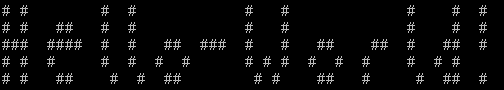

## Hello, World



It's fitting the first blog post to a development site is about Hello World

### Web

```html
<!DOCTYPE html>
<html>
  <body>
    <h1>Hello, World</h1>
  </body>
</html>
```

### More typical website


Yay! It loaded locally just fine.

```js
$(document).ready(function(){
  $("#helloWorldSpan").html("Hello, World");
});
```

```html
<!DOCTYPE html>
<html>
  <head>
    <meta charset="utf-8">
    <title>Hello World</title>
    <meta name="viewport" content="width=device-width, initial-scale=1">
    <meta name="theme-color" content="#000000">
    <meta name="keywords" content="hello world homepage, home, page, hello, world, hi, howdy, welcome, bonjour, buenas noches, buenos dias, good day, earth, globe, planet, sphere, konnichiwa, こんんちは, sekai, 世界">
    <meta name="description" content="The website of worlds best Hello World site. Where you can shop and learn and shop and learn. Hello World. Hello World all day.">
    <meta property="og:title" content="150 Ways to Hello World To Make Your Lover Jealous">
    <meta property="og:description" content="Worlds best hello world blog entry. Javascript. Html. Css. worldclass">
    <meta property="og:image" content="https://1f8.dev/thumbnail.jpg">
    <meta property="og:url" content="https://1f8.dev/thisblogpost">
    <meta name="twitter:title" content="150 Ways to Hello World To Make Your Lover Jealous">
    <meta name="twitter:description" content="Worlds best hello world blog entry. Javascript. Html. Css. worldclass">
    <meta name="twitter:image" content="https://1f8.dev/thumbnail.jpg">
    <meta name="twitter:card" content="summary_large_image">
    <meta property="fb:app_id" content="203840328403284" />
    <meta name="twitter:site" content="@1f816">
    <meta name="ROBOTS" content="ALL">
    <link rel="shortcut icon" href="favicon.ico" type="image/x-icon">
    <!-- Google Analytics -->
    <script>
      (function(i,s,o,g,r,a,m){i['GoogleAnalyticsObject']=r;i[r]=i[r]||function(){
      (i[r].q=i[r].q||[]).push(arguments)},i[r].l=1*new Date();a=s.createElement(o),
      m=s.getElementsByTagName(o)[0];a.async=1;a.src=g;m.parentNode.insertBefore(a,m)
      })(window,document,'script','https://www.google-analytics.com/analytics.js','ga');
      ga('create', 'UA-XXXXX-Y', 'auto');
      ga('send', 'pageview');
    </script>
    <!-- End Google Analytics -->
    <link href="https://fonts.googleapis.com/css?family=Noto+Sans+JP:400,500,600i,700&display=swap&subset=japanese" rel="stylesheet">
    <script src="https://ajax.googleapis.com/ajax/libs/jquery/3.5.1/jquery.min.js"></script>
    <link rel="stylesheet" href="https://stackpath.bootstrapcdn.com/font-awesome/4.7.0/css/font-awesome.min.css" crossorigin="anonymous">
    <link rel="stylesheet" href="https://stackpath.bootstrapcdn.com/bootstrap/4.3.1/css/bootstrap.min.css" integrity="sha384-ggOyR0iXCbMQv3Xipma34MD+dH/1fQ784/j6cY/iJTQUOhcWr7x9JvoRxT2MZw1T" crossorigin="anonymous">
  </head>
  <body>
    <div class="col-lg-4 col-md-4 col-sm-4 container justify-content-center">
      <h1>
        <i class="fa fa-hand-spock-o" aria-hidden="true"></i>
        <span id="helloWorldSpan"></span>
      </h1>
    </div>
    <!-- Just a few ads -->
    <script async src="https://pagead2.googlesyndication.com/pagead/js/adsbygoogle.js"></script>
    <script>(adsbygoogle=window.adsbygoogle||[]).requestNonPersonalizedAds=1;</script>
    <!-- One test unit for GDPR -->
    <ins class="adsbygoogle"     style="display:inline-block;width:970px;height:250px"
        data-ad-client="ca-pubxxx"
        data-ad-slot="slot_id">
    </ins>

    <!-- Another test unit for GDPR -->
    <ins class="adsbygoogle"     style="display:inline-block;width:250px;height:250px"
        data-ad-client="ca-pubxxx"
        data-ad-slot="slot_id">
    </ins>
    <script>(adsbygoogle = window.adsbygoogle || []).push({});</script>
    <!-- This triggers the ad request. -->
    <!-- More ads just in case -->
    <script type="text/javascript">
      (function(w) {
          var adsConfig = {
              clusterGeminiSMAdEnabled: undefined,
              clusterGeminiSMAdConfig: {},
              clusterSMAdEnabled: undefined,
              clusterPositionMeta: undefined,
              pencilAdSections: {},
              positions: {"LDRB":{"meta":{"clean":"sda-LDRB","dest":"sda-LDRB-iframe","fdb":1,"id":"LDRB","metaSize":true,"pos":"LDRB","supports":{"exp-ovr":1,"exp-push":1,"lyr":0},"w":728,"h":90},"sfoptin":1},"LREC":{"meta":{"clean":"sda-LREC","dest":"sda-LREC-iframe","fdb":1,"id":"LREC","metaSize":true,"pos":"LREC","supports":{"exp-ovr":1,"exp-push":1,"lyr":0},"w":300,"h":250},"sfoptin":1},"LREC3":{"meta":{"clean":"sda-LREC3","dest":"sda-LREC3-iframe","fdb":1,"id":"LREC3","metaSize":true,"pos":"LREC3","supports":{"exp-ovr":1,"exp-push":1,"lyr":0},"w":300,"h":250},"sfoptin":1},"LREC4":{"meta":{"clean":"sda-LREC4","dest":"sda-LREC4-iframe","fdb":1,"id":"LREC4","metaSize":true,"pos":"LREC4","supports":{"exp-ovr":1,"exp-push":1,"lyr":0},"w":300,"h":250},"sfoptin":1},"HPSPON":{"filtered":1,"sfoptin":0},"XFPAD":{"filtered":1,"sfoptin":0},"WFPAD":{"meta":{"clean":"sda-WFPAD","dest":"sda-WFPAD-iframe","id":"WFPAD","metaSize":true,"pos":"WFPAD","supports":{"exp-ovr":1,"exp-push":1,"lyr":1,"resize-to":1},"w":320,"h":50},"sfoptin":0}},
              rotation: {"adboostgrouprotation":{"MON2":{"extrapositions":"LREC3,LREC4"},"LREC3":{"extrapositions":"MON2","inview":"LREC4"},"LREC4":{"extrapositions":"MON2","inview":"LREC3"}},"autoeventrt":10000,"autorotate":true,"currentpos":"LREC3","defaultrt":10000,"grouprotation":{"MON2":"LREC3,LREC4","LREC3":"MON2","LREC4":"MON2"},"ldrbrt":10000,"lrec2selectiveenabled":true,"lrec4enabled":true,"lrec4pos":"LREC4","lrecrt":10000,"mastrt":30000,"mon2enabled":true,"mon2pos":"MON2","offset":100,"tabswitchrotate":10000},
              viewerGeminiSMAdEnabled: false,
              viewerGeminiSMAdConfig: {},
              viewerSMAdEnabled: false,
              viewerPositionMeta: {"positions":[{"clean":"viewer-INARTICLE","dest":"defaultINARTICLE","h":211,"id":"INARTICLE-1","fdb":1,"flex":{"ratio":"1.78x1","h":{"min":10},"w":{"min":10}},"supports":{"exp-ovr":1},"w":375},{"clean":"viewer-LDRB","dest":"viewer-LDRB-iframe","h":90,"id":"LDRB-1","fdb":1,"supports":{"exp-ovr":1},"w":728},{"clean":"viewer-LDRB2","dest":"viewer-LDRB2-iframe","h":90,"id":"LDRB2-1","fdb":1,"supports":{"exp-ovr":1},"w":728},{"clean":"viewer-LREC","dest":"viewer-LREC-iframe","h":250,"id":"LREC-1","fdb":1,"supports":{"exp-ovr":1},"w":300},{"clean":"viewer-LREC2","dest":"viewer-LREC2-iframe","h":250,"id":"LREC2-1","fdb":1,"supports":{"exp-ovr":1},"w":300},{"clean":"viewer-LREC3","dest":"viewer-LREC3-iframe","h":250,"id":"LREC3-1","fdb":1,"supports":{"exp-ovr":1},"w":300},{"clean":"viewer-MAST","closeBtn":{"mode":2,"useShow":1},"dest":"viewer-MAST-iframe","h":250,"id":"MAST-1","fdb":1,"supports":{"exp-ovr":1},"w":970},{"clean":"viewer-MON","dest":"viewer-MON-iframe","h":600,"id":"MON-1","fdb":1,"supports":{"exp-ovr":1},"w":300},{"clean":"viewer-MON2","dest":"viewer-MON2-iframe","h":600,"id":"MON2-1","fdb":1,"supports":{"exp-ovr":1},"w":300}],"siteAttributes":"LREC='300x250;1x1' LREC2='300x250;1x1' LREC3='300x250;1x1' UBALREC='300x250;1x1' UBALREC2='300x250;1x1' UBALREC3='300x250;1x1' MON='300x600;1x1' ctout=380","slideshowPositions":["LREC-1"],"groupRotation":{"MON2-1":"LREC3-1"}},
              viewerViewportAdFetch: {},
              viewerWfpadAdEnabled: undefined,
          };
          if (!w.adsConfig) {
              w.adsConfig = adsConfig;
          }
      }(window));
    </script>
    <!-- End yahoo ads -->
    <!-- I guess well load in our content now -->
    <script src="main.js"></script>
  </body>
</html>
```

### Python

> I will here demonstrate the power and usability of the scripting language called Python by solving a rather complex task in a graceful and efficient manner through the aforementioned scripting language's operators on – and generators of – data structures such as lists and dictionaries.

This is obviously superfluous which is the purpose of this [StackExchange](https://codegolf.stackexchange.com/questions/4838/most-complex-hello-world-program-you-can-justify) thread

```python
# 1: Define alphabet:
a = range(255)

# 2: Letter count:
n = (0, 0, 0, 0, 0, 0, 0, 0, 0, 0, 0, 0, 0, 0, 0, 0, 0, 0, 0, 0, 0, 0, 0, 0, 0,
     0, 0, 0, 0, 0, 0, 0, 1, 0, 0, 0, 0, 0, 0, 0, 0, 0, 0, 0, 1, 0, 0, 0, 0, 0,
     0, 0, 0, 0, 0, 0, 0, 0, 0, 0, 0, 0, 0, 0, 0, 0, 0, 0, 0, 0, 0, 0, 1, 0, 0,
     0, 0, 0, 0, 0, 0, 0, 0, 0, 0, 0, 0, 1, 0, 0, 0, 0, 0, 0, 0, 0, 0, 0, 0, 0,
     1, 1, 0, 0, 0, 0, 0, 0, 3, 0, 0, 2, 0, 0, 1, 0, 0, 0, 0, 0, 0, 0, 0, 0, 0,
     0, 0, 0, 0, 0, 0, 0, 0, 0, 0, 0, 0, 0, 0, 0, 0, 0, 0, 0, 0, 0, 0, 0, 0, 0,
     0, 0, 0, 0, 0, 0, 0, 0, 0, 0, 0, 0, 0, 0, 0, 0, 0, 0, 0, 0, 0, 0, 0, 0, 0,
     0, 0, 0, 0, 0, 0, 0, 0, 0, 0, 0, 0, 0, 0, 0, 0, 0, 0, 0, 0, 0, 0, 0, 0, 0,
     0, 0, 0, 0, 0, 0, 0, 0, 0, 0, 0, 0, 0, 0, 0, 0, 0, 0, 0, 0, 0, 0, 0, 0, 0,
     0, 0, 0, 0, 0, 0, 0, 0, 0, 0, 0, 0, 0, 0, 0, 0, 0, 0, 0, 0, 0, 0, 0, 0, 0,
     0, 0, 0, 0, 0, 0)

# 3: Merge to dictionary:
d = { x: y for x, y in zip(a,n) }

# 4: 'Initialize' characters
l = ''.join([chr(c) *n for c,n in d.items()])

# 5: Define the order of the characters, initialize final string
#    and sort before outputting:
z = [6,5,0,7,11,1,2,3,4,8,9]
o = [0] * 13

for c in l:
    i = z.pop(0)
    o[i] = c

print ''.join(o)
```
