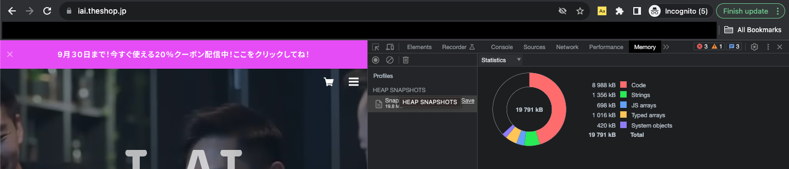
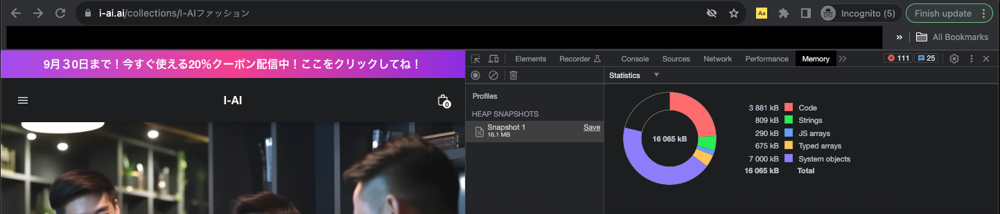

# ショッピファイHydrogenとBASE（ベイス)の比較

今回は無料で構築できるECショップで話題のBASE（ベース）とカナダ発国際的に有名なショッピファイの比較をさせていただきます。この比較はできるだけデータをもとに比較していきたいと思いますが、使い勝手やUIの感じなど私個人の意見や偏見もあると思いますが、これからショップ開設をしようとお考えの方のお役に立てればと思います。

## コストの比較

  まずは一番気になるショップ設立にかかるコストを見ていきましょう。ショッピファイHydrogenはショッピファイのパートナーズアカウントへの登録が必要なため月額３３米ドルかかり、無料お試し期間はあるものの、その後は購読に切り替える必要があるので年間５００米ドル以上の売り上げがないと損。ベイスはアカウント登録からショップの立ち上げまで無料でできるためショップのコンセプトを試したい方には好都合だと思います。ここだけ見るとベイスの方が格安で良いと思うかもしれませんが、決済の回数が増えれば増えるほどベイスの方がコストが上がるため注意が必要です。

  例１:100回の決済数だといくら売り上げを上げればショッピファイの方が得かという質問をチャットGPT先生に投げかけてみました。
      `
        1ドルが149円のレートと取引回数Nが100回として計算を進めます。

        手数料の差: 3.6% - 3.4% = 0.2%

        ショッピファイの月額使用料は $33USD。現在の為替レートで計算すると:
        $33 × 149円/$ = 4,917円

        取引回数Nが100回の場合、ベイスの固定手数料40円による差額は:
        40円 × 100 = 4,000円

        手数料の差と固定手数料の差額の合計は:
        0.002x + 4,000円 = 4,917円

        xは月の売上額を示します。上記の式からxを求めます:
        0.002x = 917円
        x = 917円 ÷ 0.002
        x = 458,500円

        つまり、月の売上が458,500円のとき、ベイスとショッピファイの手数料のコストが同じになります。
        この売上額以上ならば、ショッピファイの方が手数料の面でお得ということになります。
      


  この例だと例えば5000円の商品を１ヶ月で１００人の人に売るようになった頃からShopifyに移行する方が得になるということですね。ただ移行するときにデータの移動のためのツールや自分で全てできる場合を除いて人件費などがかかってくるので、ビジネスのゴール、キャパによってどちらのプラットフォームが適しているかを事前に考える必要があるかもしれません。

  例２:2000円の商品を売った場合何回目の決済からショッピファイの方が特になるかをチャットGPT先生に質問してみました。
      ```
        ベイスの手数料:
        3.6%の手数料: 0.036 × 2000円 = 72円
        40円の固定手数料
        合計: 72円 + 40円 = 112円

        ショッピファイの手数料:
        3.4%の手数料: 0.034 × 2000円 = 68円
        月額使用料: $33 × 149円/$ = 4,917円

        ショッピファイの月額使用料を考慮するため、ショッピファイの方がベイスよりもどれだけ安いかを考えます。
        差額: 112円 - 68円 = 44円

        この差額を月額使用料4,917円で割ります:
        4,917円 ÷ 44円/回 = 約111.75回

        つまり、1ヶ月に約112回以上の取引がある場合、ショッピファイの方が総コストの面でお得になります。
     


この結果を見る限りでは商品の金額にもよりますが、500円〜5000円の商品を売る場合、月々120~100回以上の決済数が発生する場合ショッピファイの方が得ということになります。しかし、ベイスの強みは売り上げが発生するまでコストがかからないという点だと思うので、資本金が少ないビジネスにはもってこいのプラットホームです。

# ショップ立ち上げの安易度

ベイスの立ち上げはコーディングの経験がなくても立ち上げられるので立ち上げの安易度では５つ星⭐️⭐️⭐️⭐️⭐️ではないでしょうか。メールとパスワードの登録後、質問に答えていくだけでプロフェッショナルな見栄えのショップが１０〜１５分ほどで立ち上がります。そこから商品の登録をして、Wixやワードプレスのような感じで追加したい内容を追加してショップを公開すればECショップの完成です。一方ショッピファイHydrogenはコーディングの経験がないと難しい内容なので初心者の方にはお勧めしません。しかしショッピファイはHydrogen以外にも無料のデザインでショップを簡単に立ち上げることができるベイスと同じような機能もあるのでショッピファイのショップ立ち上げの安易度は星⭐️⭐️⭐️⭐️だと思います。

# パフォーマンスの比較
  
### ショッピファイHydrogen

- **パフォーマンス**: 95
- **アクセシビリティ**: 88
- **ベストプラクティス**: 75
- **SEO**: 100
- **トータルパフォーマンス**: 95
- **First Contentful Paint (FCP)**: 1.1秒
- **Largest Contentful Paint (LCP)**: 1.2秒
- **Total Blocking Time (TBT)**: 10ms
- **Cumulative Layout Shift (CLS)**: 0
- **Speed Index**: 1.1秒

### BASE(ベイス)

- **パフォーマンス**: 95
- **アクセシビリティ**: 61
- **ベストプラクティス**: 92
- **SEO**: 92
- **トータルパフォーマンス**: 95
- **First Contentful Paint (FCP)**: 0.8秒
- **Largest Contentful Paint (LCP)**: 1.3秒
- **Total Blocking Time (TBT)**: 80ms
- **Cumulative Layout Shift (CLS)**: 0.001
- **Speed Index**: 1.4秒

## 比較の要点

パフォーマンスのスコアは、ショッピファイHydrogenとBASE(ベイス)の両方で同じ95となっています。アクセシビリティのスコアに関してはショッピファイHydrogenが88で、BASE(ベイス)が61と、Hydrogenの方が高いスコアを記録しています。SEOに関しては、Hydrogenが100で最高スコアを獲得しており、BASE(ベイス)は92です。First Contentful Paint (FCP)では、BASE(ベイス)が0.8秒で、Hydrogenよりも少し早い結果を示していますが、Speed IndexではBASE(ベイス)が1.4秒でHydrogenよりも遅くなっています。アクセシビリティスコア以外はショッピファイとベイスの差がほぼ無いようにうかがわれますが、このアクセシビリティの差はどう言った意味をもつのかをチャットGPTに聞いてリストアップしてみました。

### アクセシビリティはどうして重要か？
1. 法的要件と規制の強化

多くの国や地域でアクセシビリティの基準やガイドラインが制定されています。企業はこれらの法的要件を遵守する必要があり、罰金や訴訟のリスクを回避するためにアクセシビリティの確保に注力しています。

2. ユーザーエクスペリエンスとの関連

良好なアクセシビリティは、全体的なユーザーエクスペリエンスの向上にも寄与します。このため、UXデザインの中でアクセシビリティの要件が強調されています。

3. ブランドイメージと企業の社会的責任

アクセシビリティへの取り組みは、企業の社会的責任（CSR）としての側面も持っています。ブランドイメージの向上や顧客の信頼を獲得するための要因としても認識されています。

4. 技術の進化とツールの普及

様々なツールや技術が登場し、アクセシビリティの評価や改善がより手軽に、そして効果的に行えるようになってきました。

5. 高齢化社会の影響

世界的な高齢化のトレンドを受けて、高齢者を含む幅広いユーザー層に対応するためのアクセシビリティ対策が増えています。

6. 教育と啓発の拡大

開発者やデザイナーを対象としたアクセシビリティ教育の機会が増えてきました。これにより、初めからアクセシブルなデザインや開発が推進されています。


企業のアクセシビリティに対する取り組みは、今後もさらに進化し続けるでしょう。全てのユーザーにとって使いやすいウェブの実現のために、この動きに注目していきたいと思います。


# Chrome DevToolsを使用したメモリ分析

ウェブサイトのパフォーマンスは、ユーザーエクスペリエンスに大きく影響します。今回は、Chromeの開発者ツールを使用して、BASEショップとShopify Hydrogenショップのメモリ使用量を分析しました。それぞれのショップの向上点や問題点について検証してみました。


## メモリ分析結果

### **BASEショップ:**

- **合計メモリ**: 19,791 kB
  - コード: 8,988 kB
  - 文字列: 1,356 kB
  - JS配列: 698 kB
  - 型付き配列: 1,016 kB
  - システムオブジェクト: 420 kB



### **Shopify Hydrogenショップ:**
- **合計メモリ**: 16,065 kB
  - コード: 3,881 kB
  - 文字列: 809 kB
  - JS配列: 290 kB
  - 型付き配列: 675 kB
  - システムオブジェクト: 7,000 kB



## 分析と考察

### BASEショップ:
- **コードのメモリ使用量**が高い。不要なライブラリやスクリプトがロードされている可能性が考えられる。
- **JS配列**の使用量もやや高め。データ構造の最適化や不要なデータの削除を検討することで改善が期待できる。

### Shopify Hydrogenショップ:
- **システムオブジェクト**の使用量が顕著に高い。DOM要素が多すぎるか、レンダリングが非効率的である可能性がある。
- 一方、コードや文字列、配列の使用量はBASEショップよりも低く、これらの点では良好な結果が得られている。

## スケーラビリティの考察

Shopify Hydrogenショップは、コード、文字列、JS配列、型付き配列の各セクションでBASEショップよりも少ないメモリを使用しています。これは、ショップがより軽量で効率的に設計されていることを示しており、大量のトラフィックやデータにも対応しやすい可能性が考えられます。

一方、BASEショップはコードの部分で大きなメモリを消費していますが、システムオブジェクトのメモリ使用量は非常に低いです。Shopify Hydrogenショップのシステムオブジェクトのメモリ使用量が高いことは、ショップが成長するにつれてこの部分の最適化が必要になるかもしれません。

## 結論

両ショップともにスケーラビリティの観点での向上点があります。しかし、全体的に見ると、Shopify Hydrogenショップはコードやデータ構造に関してはよりスケーラビリティに優れていると言えそうです。一方、システムオブジェクトの最適化に関しては、今後の成長を見越して取り組む必要があるでしょう。


-----
参考
- https://thebase.com/
- https://www.shopify.com/jp
- ChatGPT v4

